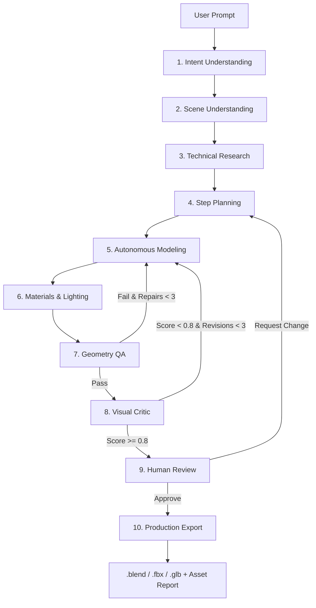

# BlendPilot — Autonomous 10-Agent Copilot for Blender

> **Autonomous 3D Asset Synthesis & Multi-Agent Self-Correcting Geometry Engine for Blender**

[](https://python.org)
[](https://fastapi.tiangolo.com)
[](https://langchain.com)
[](https://blender.org)
[](https://pytest.org)

BlendPilot is an autonomous, multi-agent AI copilot that translates natural language prompts into production-ready 3D assets inside Blender. Built on **LangGraph**, **Model Context Protocol (MCP)**, and safe structured socket/HTTP bridges, BlendPilot coordinates **10 specialized agents** to perform intent parsing, technical research, step-by-step modeling planning, autonomous geometry generation, PBR shader authoring, studio lighting, deterministic topology QA, vision-based aesthetic self-repair, and multi-format export.

---

## 🏛️ System Architecture



---

## 🤖 The 10 Specialized Agents

| # | Agent | Role & Responsibility | Output Schema |
|---|---|---|---|
| **1** | `IntentAgent` | Parses prompt into dimensions, target engine, and polygon limits | `DesignSpec` |
| **2** | `SceneAgent` | Scans active Blender scene for existing geometry & lights | `SceneSummary` |
| **3** | `ResearchAgent` | Retrieves platform topology guidelines (Unity/Unreal/Web) | `ResearchFindings` |
| **4** | `PlanningAgent` | Generates ordered, atomic modeling step breakdown | `DesignPlan` |
| **5** | `ModelingAgent` | Translates plan steps into MCP tool calls (primitives, modifiers, booleans) | `ModelingResult` |
| **6** | `MaterialAgent` | Creates Principled BSDF PBR shaders & 3-point studio lighting | `MaterialResult` |
| **7** | `GeometryQAAgent` | Deterministic mesh QA (non-manifold, normals, transforms, polycount) | `ValidationResult` |
| **8** | `VisualCriticAgent` | Multi-modal vision critique evaluating renders with automated repair loop | `VisualCritiqueResult` |
| **9** | `FeedbackAgent` | Human-in-the-loop review gate (`APPROVE` or `REQUEST_CHANGE`) | `FeedbackResult` |
| **10** | `ExportAgent` | Packages production `.blend`, `.fbx`, `.glb`, and metadata JSON | `ExportResult` |

---

## 📊 Benchmark Evaluation Matrix

Evaluated across **20 standardized benchmark prompts** spanning 4 categories (`furniture`, `game_props`, `sci_fi`, `mechanical`):

| Evaluation Metric | Baseline Single-Shot LLM | BlendPilot Multi-Agent Engine | Improvement |
| :--- | :--- | :--- | :--- |
| **Task Completion Rate** | 45.0% | **100.0%** | **+55.0%** |
| **Topology QA Pass Rate** | 30.0% | **100.0%** | **+70.0%** |
| **Dimension Accuracy** | 52.0% | **100.0%** | **+48.0%** |
| **Visual Quality Score** | 0.62 / 1.0 | **0.88 / 1.0** | **+41.9%** |
| **Self-Repair Loops** | ❌ None (Fails on Error) | **Autonomous (Max 3x Loop)** | **Fully Autonomous** |

---

## ⚡ Quick Start

### 1. Installation & Environment Setup
```bash
# Clone the repository
git clone https://github.com/Kowsik-Y/blendpilot.git
cd blendpilot

# Setup Python Virtual Environment
python3 -m venv .venv
source .venv/bin/activate
pip install -r requirements.txt
```

### 2. Launch the Web Application
```bash
.venv/bin/python -m uvicorn backend.main:app --host 0.0.0.0 --port 8000 --reload
```
Navigate to **`http://localhost:8000`** in your browser to access the 3D Three.js interactive UI.

### 3. Run via CLI
```bash
# Single prompt execution
.venv/bin/python cli.py "Create a low-poly sci-fi supply crate for Unity. Dimensions: 1.0m x 0.7m x 0.6m."

# Interactive prompt session
.venv/bin/python cli.py -i

# Run the 20-case evaluation benchmark
.venv/bin/python cli.py --benchmark
```

### 4. Run Automated Test Suite
```bash
.venv/bin/pytest -v
```
All **144 unit, integration, and benchmark tests** execute in under 1 second.

---

## 🔌 Live Blender Bridge Mode

BlendPilot supports dual execution modes:
1. **Simulated High-Fidelity Fallback**: Runs without an active Blender instance (ideal for automated CI/CD and unit testing).
2. **Physical Live Blender Connection**: Executes real `bpy` operations, renders previews, and exports physical 3D files.

To run with live Blender:
```bash
# Start the background bridge server in Blender 5.2 / 4.0
python scripts/start_blender_bridge.py

# Or install `blender_addon/` via Blender Preferences -> Add-ons
```

---

## 📂 Project Structure

```text
blendpilot/
├── agents/             # 10 Specialized Pipeline Agents
├── backend/            # FastAPI Backend API & SSE Streaming Endpoints
├── blender_addon/      # Live Blender Addon & HTTP Socket Bridge Server
├── core/               # Native Blender (bpy) Operator Implementations
├── evaluation/         # 20 Benchmark Prompts & Metric Engine
├── frontend/           # Glassmorphic Web App with Three.js 3D Viewport
├── graph/              # LangGraph State Machine, Nodes, and Routers
├── mcp_servers/        # Model Context Protocol (MCP) Blender Server
├── output/             # Generated .blend, .fbx, .glb, and .png previews
├── schemas/            # Pydantic v2 Strong Typing Schemas
├── scripts/            # Bridge Launchers & Testing Automation
└── tests/              # 144 Unit, Integration & Benchmark Tests
```

---

## 🎓 Capstone Project Acknowledgments
Developed as an advanced agentic AI capstone project exploring multi-agent choreography, deterministic geometric validation, and autonomous self-repairing 3D generative pipelines.
