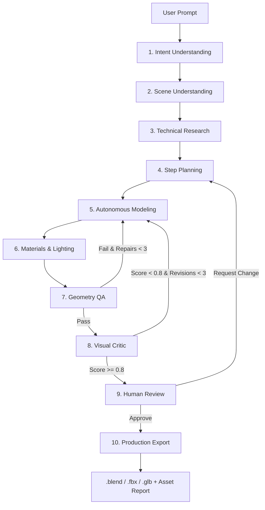

# System Architecture

BlendPilot's architecture revolves around a stateful graph powered by **LangGraph**, providing structured multi-agent coordination with built-in loops for self-correction.

## Multi-Agent LangGraph

The generation process follows a structured DAG (Directed Acyclic Graph) where specialized agents pass a validated `State` object down the pipeline.

## Core Components

1. **Agent Engine (`agents/` & `graph/`)**: Parses logic, manages states, and interfaces with the LLM backend.
2. **MCP Bridge (`mcp_servers/`)**: Converts intent-driven outputs from the agents into actionable tool calls using the Model Context Protocol.
3. **Blender Native Execution (`core/` & `blender_addon/`)**: Real-time `bpy` environment where the actual geometric modifications, shader creation, and rendering occur.
4. **Validation Engine (`evaluation/` & `agents/GeometryQAAgent`)**: Ensures outputs mathematically match requested dimensions and constraints.

## State Management

Each node in the LangGraph updates a strongly-typed Pydantic schema (`schemas/`), ensuring data reliability between jumps. If a node fails, the graph route conditionally branches back to a previous node (e.g., from `Geometry QA` back to `Modeling` if non-manifold geometry is detected).
